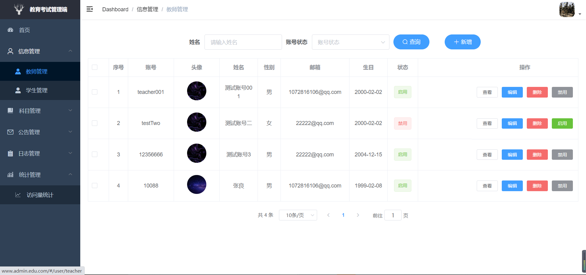

# 在线考试系统

#### 一、项目介绍
一个基于SpringBoot、SpringSecurity、Mybatis-Plus、Redis、Docker、RabbitMQ、Vue等技术栈实现的在线考试系统，实现了管理员进行系统管理，教师进行题目和试卷的创建、发布、编辑以及批阅试卷、学生进行题库练习、考试、错题集等主要功能的实现。

#### 二、项目演示

#### 三、环境搭建
- 后端环境搭建
    1. SpringBoot2.6.7
    2. MySQL5.X/MySQL8.x
    3. Redis6.2.4
    4. RabbitMQ3.9.11
    5. CentOS7.X
    
